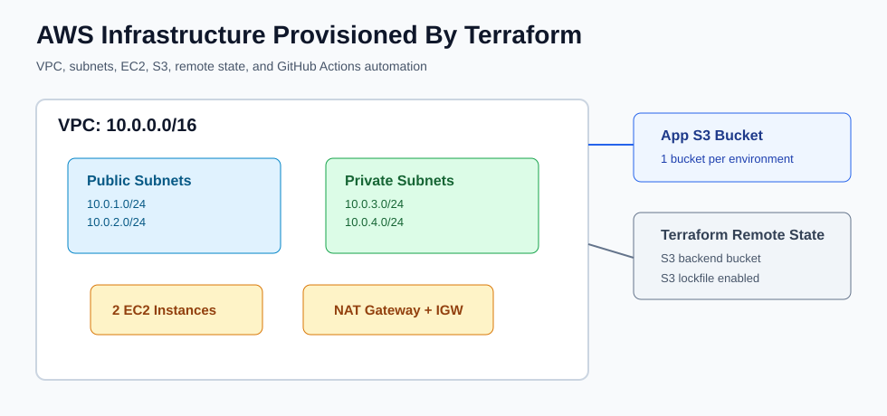
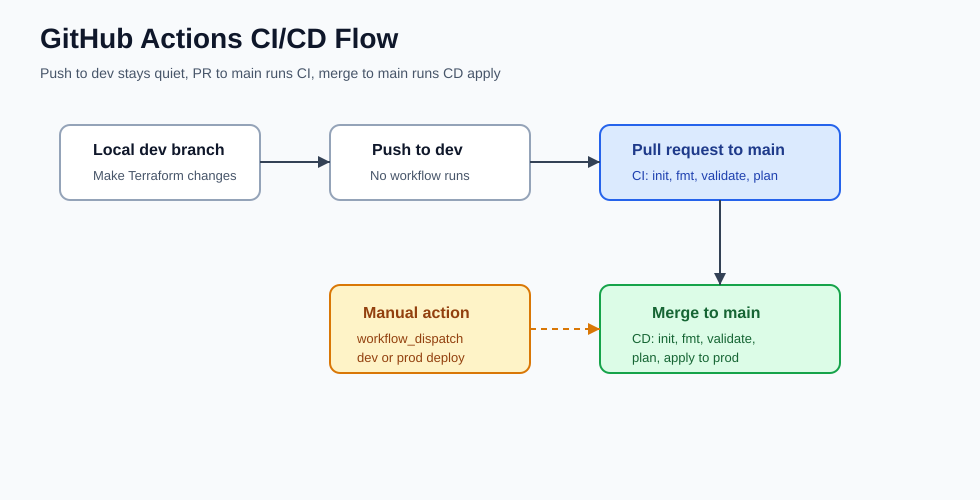

# AWS Infrastructure With Terraform And GitHub Actions

This project provisions AWS infrastructure using Terraform and deploys it through GitHub Actions. It was originally based on a Jenkins flow and has now been migrated to a GitHub Actions CI/CD pipeline.

The final setup uses:

- Terraform for Infrastructure as Code
- GitHub Actions for CI/CD
- AWS OIDC authentication for secure GitHub-to-AWS access
- S3 remote backend for Terraform state
- S3 lockfile for Terraform state locking
- Separate `dev` and `prod` Terraform environment folders
- Manual destroy workflow for safe cleanup

## Architecture



## GitHub Actions Flow



## Project Structure

```text
aws-infra-terraform-github-actions/
├── .github/
│   └── workflows/
│       ├── terraform.yml
│       └── terraform-destroy.yml
├── docs/
│   └── images/
│       ├── architecture.svg
│       └── github-actions-flow.svg
├── environments/
│   ├── dev/
│   │   ├── backend.tf
│   │   ├── main.tf
│   │   └── provider.tf
│   └── prod/
│       ├── backend.tf
│       ├── main.tf
│       └── provider.tf
├── modules/
│   ├── ec2/
│   ├── s3/
│   └── vpc/
├── .gitattributes
├── provider.tf
└── README.md
```

## Infrastructure Created

Each environment creates:

- 1 VPC
- 2 public subnets
- 2 private subnets
- Internet Gateway
- NAT Gateway
- Route tables and route table associations
- 2 EC2 instances
- 1 application S3 bucket

Current application bucket names:

```text
dev  -> dev-app-data-848504403730
prod -> prod-app-data-848504403730
```

Terraform backend bucket:

```text
aws-terraform-state-file-2026-848504403730
```

## Branch Strategy

This project uses two main branches:

```text
dev  -> development changes
main -> production deployment
```

Workflow behavior:

```text
Push to dev          -> workflow does not run
PR from dev to main  -> CI runs only
Merge PR to main     -> CD runs and applies prod
Manual run           -> choose dev or prod
Manual destroy       -> choose dev or prod and type destroy
```

## AWS Prerequisites

Before running GitHub Actions, create the Terraform backend S3 bucket manually.

### 1. Create Backend S3 Bucket

Create this bucket in AWS S3:

```text
aws-terraform-state-file-2026-848504403730
```

Use these settings:

```text
Region: ap-south-1 / Asia Pacific (Mumbai)
Block all public access: ON
Bucket versioning: Enable
Default encryption: SSE-S3
```

Do not make the Terraform state bucket public.

### 2. Create GitHub OIDC Provider

In AWS IAM:

```text
IAM -> Identity providers -> Add provider
```

Use:

```text
Provider type: OpenID Connect
Provider URL: https://token.actions.githubusercontent.com
Audience: sts.amazonaws.com
```

### 3. Create IAM Role For GitHub Actions

Create an IAM role that GitHub Actions can assume using OIDC.

Example trust policy:

```json
{
  "Version": "2012-10-17",
  "Statement": [
    {
      "Effect": "Allow",
      "Principal": {
        "Federated": "arn:aws:iam::848504403730:oidc-provider/token.actions.githubusercontent.com"
      },
      "Action": "sts:AssumeRoleWithWebIdentity",
      "Condition": {
        "StringEquals": {
          "token.actions.githubusercontent.com:aud": "sts.amazonaws.com"
        },
        "StringLike": {
          "token.actions.githubusercontent.com:sub": "repo:YOUR_GITHUB_USERNAME/aws-infra-terraform-github-actions:*"
        }
      }
    }
  ]
}
```

For learning or lab usage, `AdministratorAccess` can be attached to this role. For production usage, restrict the role to only the required services.

### 4. Add GitHub Secret

In GitHub:

```text
Repository -> Settings -> Secrets and variables -> Actions -> New repository secret
```

Add:

```text
Name: AWS_ROLE_ARN
Value: arn:aws:iam::848504403730:role/YOUR_GITHUB_ACTIONS_ROLE_NAME
```

## Terraform Backend

Both environments use an S3 backend.

Dev:

```hcl
terraform {
  backend "s3" {
    bucket       = "aws-terraform-state-file-2026-848504403730"
    key          = "dev/terraform.tfstate"
    region       = "ap-south-1"
    use_lockfile = true
    encrypt      = true
  }
}
```

Prod:

```hcl
terraform {
  backend "s3" {
    bucket       = "aws-terraform-state-file-2026-848504403730"
    key          = "prod/terraform.tfstate"
    region       = "ap-south-1"
    use_lockfile = true
    encrypt      = true
  }
}
```

The backend uses `use_lockfile = true`, so Terraform creates a lock file in S3 while a run is active.

## CI/CD Workflow

The main deployment workflow is:

```text
.github/workflows/terraform.yml
```

It runs on:

```yaml
pull_request:
  branches:
    - main

push:
  branches:
    - main

workflow_dispatch:
```

### PR From Dev To Main

When a pull request is raised from `dev` to `main`, the workflow runs CI:

```text
terraform init
terraform fmt -check -recursive
terraform validate
terraform plan -out=tfplan
```

It does not run `terraform apply` on pull requests.

### Merge To Main

When the PR is merged into `main`, GitHub creates a push to `main`. That runs CD:

```text
terraform init
terraform fmt -check -recursive
terraform validate
terraform plan -out=tfplan
terraform apply -auto-approve tfplan
```

### Manual Deployment

The workflow also supports manual runs through `workflow_dispatch`.

From GitHub:

```text
Actions -> Terraform CI/CD -> Run workflow
```

Choose:

```text
environment: dev
```

or:

```text
environment: prod
```

Manual deployment runs `apply`, so use it carefully.

## Destroy Workflow

The destroy workflow is:

```text
.github/workflows/terraform-destroy.yml
```

It is manual only.

From GitHub:

```text
Actions -> Terraform Destroy -> Run workflow
```

Choose:

```text
environment: prod
confirm_destroy: destroy
```

or:

```text
environment: dev
confirm_destroy: destroy
```

The workflow runs:

```text
terraform init
terraform validate
terraform plan -destroy -out=tfdestroy
terraform apply -auto-approve tfdestroy
```

Important: do not delete the Terraform backend S3 bucket before destroy. Terraform needs the state file to know which resources to remove.

## Step By Step Deployment

### 1. Work On Dev Branch

```bash
git checkout dev
```

Make Terraform changes.

### 2. Commit And Push Dev

```bash
git status
git add .
git commit -m "Update Terraform infrastructure"
git push origin dev
```

Pushing to `dev` does not run the workflow.

### 3. Raise PR

In GitHub:

```text
Pull requests -> New pull request
base: main
compare: dev
Create pull request
```

This runs CI only.

### 4. Merge PR

After CI passes:

```text
Merge pull request
```

This triggers CD on `main` and runs Terraform apply for prod.

## Step By Step Destroy

### 1. Open Actions

```text
GitHub repo -> Actions
```

### 2. Select Destroy Workflow

```text
Terraform Destroy
```

### 3. Run Workflow

Click:

```text
Run workflow
```

Enter:

```text
environment: prod
confirm_destroy: destroy
```

### 4. Verify AWS

After the workflow completes, check:

```text
EC2 -> Instances
VPC -> VPCs
S3 -> Buckets
```

The Terraform-managed resources should be removed.

## Troubleshooting

### 1. S3 Backend Bucket Create Error

Error:

```text
Failed to create bucket
A conflicting conditional operation is currently in progress against this resource
```

Cause:

```text
AWS is still processing a bucket create/delete request, or the same bucket name was tried multiple times.
```

Fix:

```text
Wait 2-5 minutes and try again.
Use a more unique bucket name if needed.
```

Final backend bucket used:

```text
aws-terraform-state-file-2026-848504403730
```

### 2. S3 Backend Region Error

Error:

```text
HTTP 301 redirect while accessing S3 backend bucket
```

Cause:

```text
The bucket exists in a different region than backend.tf.
```

Fix:

```text
Create the backend bucket in ap-south-1, or change backend.tf to the bucket's actual region.
```

### 3. Deprecated DynamoDB Locking Warning

Warning:

```text
dynamodb_table is deprecated
```

Fix:

Use:

```hcl
use_lockfile = true
```

instead of:

```hcl
dynamodb_table = "terraform-locks"
```

### 4. Terraform Format Check Failed

Error:

```text
Terraform exited with code 3
backend.tf
main.tf
```

Cause:

```text
Terraform files were not formatted according to terraform fmt.
```

Fix:

Run locally if Terraform is installed:

```bash
terraform fmt -recursive
```

Or fix formatting manually. The project also includes `.gitattributes`:

```text
*.tf text eol=lf
*.tfvars text eol=lf
*.yml text eol=lf
*.yaml text eol=lf
```

This helps prevent Windows line ending issues in GitHub Actions.

### 5. S3 Application Bucket Already Exists

Error:

```text
BucketAlreadyExists: The requested bucket name is not available.
```

Cause:

```text
S3 bucket names are globally unique across all AWS accounts.
```

Fix:

Use a unique name, usually with your AWS account id.

Current bucket names:

```text
dev-app-data-848504403730
prod-app-data-848504403730
```

### 6. Push To Dev Does Not Run Workflow

This is expected.

The workflow was intentionally configured so:

```text
Push to dev -> no workflow
PR to main  -> CI
Push main   -> CD
```

### 7. Terraform Apply Created Some Resources But Failed Later

Cause:

```text
Terraform may create VPC, EC2, or NAT Gateway resources before failing on another resource such as S3.
```

Fix:

After fixing the error, run the workflow again. Terraform reads state and continues from the existing resources instead of recreating everything.

If cleanup is needed, use the manual destroy workflow.

### 8. GitHub Actions Cannot Access AWS

Possible causes:

```text
AWS_ROLE_ARN secret is missing or wrong.
OIDC provider is not created.
IAM role trust policy does not match the GitHub repo.
IAM role does not have enough permissions.
```

Fix:

Check:

```text
GitHub repo -> Settings -> Secrets and variables -> Actions -> AWS_ROLE_ARN
AWS IAM -> Identity providers
AWS IAM -> Roles -> Trust relationships
```

## Useful Commands

Check branch:

```bash
git branch
```

Check local branch tracking:

```bash
git branch -vv
```

Check remote:

```bash
git remote -v
```

Commit changes:

```bash
git add .
git commit -m "Update project"
git push origin dev
```

Create dev branch if needed:

```bash
git checkout -b dev
git push -u origin dev
```

## Important Notes

- Do not store AWS access keys in GitHub secrets for this project. Use OIDC and `AWS_ROLE_ARN`.
- Do not make the Terraform state bucket public.
- Do not delete the backend S3 bucket before destroy.
- `terraform destroy` is manual only for safety.
- Pushes to `dev` are intentionally quiet.
- Production apply happens only after merge to `main` or manual workflow dispatch.
